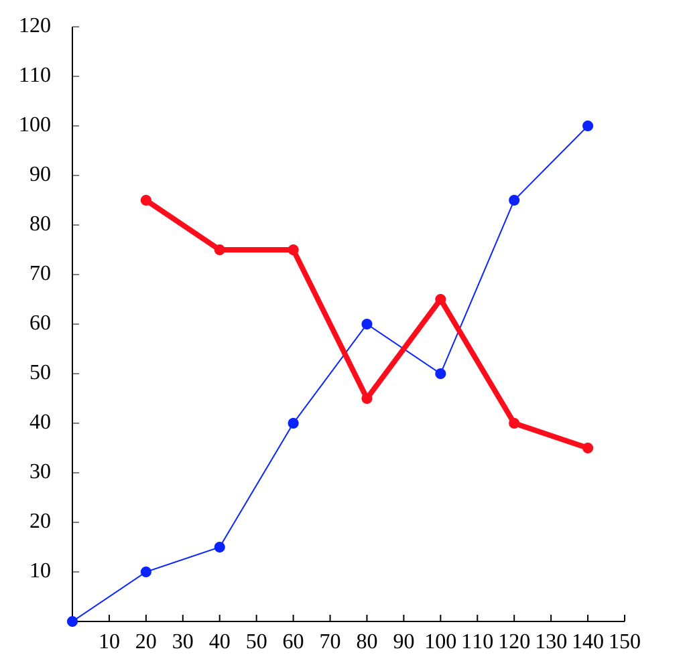

# @infi-knight/line-chart-react

> React component for creating line charts

[](https://www.npmjs.com/package/@infi-knight/line-chart-react) [](https://standardjs.com)

## Install

```bash
npm install --save @infi-knight/line-chart-react
```

## Usage

```jsx
import React from 'react'

import LineChart from '@infi-knight/line-chart-react'

// create config for line chart
// all options are required
const chartConfig = {
  id: 'myCanvas',
  minX: 0,
  maxX: 150,
  minY: 0,
  maxY: 120,
  height: 500,
  width: 500,
  unitsPerTickX: 10, 
  unitsPerTickY: 10,
  showAxes: true // set to falset to disable ticks on axes
}

// A single line chart can render multiple lines (see image above)
// styles is optional and defaults to { lineColor: 'black', lineWidht: 2 }
const chartItems = [
  {
    styles: { lineColor: 'blue', lineWidth: 2 },
    points: [
      {
        x: 0,
        y: 0
      },
      {
        x: 20,
        y: 10
      },
      {
        x: 40,
        y: 15
      },
      {
        x: 60,
        y: 40
      },
      {
        x: 80,
        y: 60
      },
      {
        x: 100,
        y: 50
      },
      {
        x: 120,
        y: 85
      },
      {
        x: 140,
        y: 100
      }
    ]
  },
  {
    styles: { lineColor: 'red', lineWidth: 8 },
    points: [
      {
        x: 20,
        y: 85
      },
      {
        x: 40,
        y: 75
      },
      {
        x: 60,
        y: 75
      },
      {
        x: 80,
        y: 45
      },
      {
        x: 100,
        y: 65
      },
      {
        x: 120,
        y: 40
      },
      {
        x: 140,
        y: 35
      }
    ]
  }
]

const App = () => {
  return <LineChart chartItems={chartItems} chartConfig={chartConfig} />
}

export default App

```

Result:



## Development

Local development is broken into two parts (ideally using two tabs).

First, run rollup to watch your `src/` module and automatically recompile it into `dist/` whenever you make changes.

```bash
npm start # runs rollup with watch flag
```

The second part will be running the `example/` create-react-app that's linked to the local version of your module.

```bash
# (in another tab)
cd example
npm start # runs create-react-app dev server
```

Now, anytime you make a change to your library in `src/` or to the example app's `example/src`, `create-react-app` will live-reload your local dev server so you can iterate on your component in real-time.

#### Publishing to npm

```bash
npm publish
```

This builds `commonjs` and `es` versions of your module to `dist/` and then publishes your module to `npm`.

Make sure that any npm modules you want as peer dependencies are properly marked as `peerDependencies` in `package.json`. The rollup config will automatically recognize them as peers and not try to bundle them in your module.

#### Deploying to Github Pages

```bash
npm run deploy
```

This creates a production build of the example `create-react-app` that showcases your library and then runs `gh-pages` to deploy the resulting bundle.

## TODO:

- fix canvas scaling on HiDpi screens


## License

MIT © [Infi-Knight](https://github.com/Infi-Knight)
